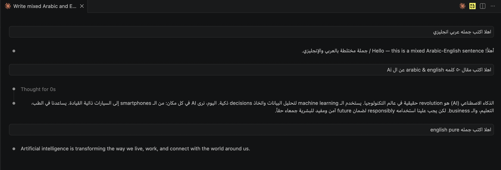

# Lara Claude RTL Patcher


**Lara Claude RTL Patcher** is a production-focused VS Code extension that patches installed **Claude Code for VS Code** webview assets to improve **Arabic/RTL mixed-text readability** while preserving Claude’s native code rendering.

## Why This Exists

Arabic + English mixed content is a real daily workflow for many developers, founders, and teams across MENA. Default rendering can make sentence flow, list markers, and mixed-direction text harder to read.

This extension applies targeted RTL/BiDi fixes for natural reading flow without taking over Claude’s full visual system.

## Demo



## Core Guarantees

- Keeps Claude code rendering native (`pre`, `code`, `kbd`, `samp` are not restyled by this patch).
- Improves mixed Arabic/English direction behavior in normal text content.
- Stabilizes user message direction behavior for Arabic and mixed messages.
- Improves RTL list marker alignment and list readability.
- Creates reversible per-file backups before patching.

## What It Patches

The patcher scans the installed Claude extension and applies patch blocks to compatible webview files:

- `.css`
- `.html` / `.htm`
- `.js`

It inserts clearly delimited patch blocks and can safely revert them later.

## What It Intentionally Does **Not** Do

- It does not replace Claude UI/branding.
- It does not force custom syntax highlighting.
- It does not rewrite source code blocks.
- It does not collect telemetry or send your content anywhere.

## Features

- Automatic Claude extension target detection.
- Runtime RTL/BiDi adjustments for non-code text.
- User message direction handling tuned for Arabic + mixed text.
- Heading/list direction consistency improvements.
- Safe backup strategy: `<file>.lara-claude-rtl-patcher.bak`.
- One-click commands to apply, revert, and check status.

## Commands

- `Lara Claude RTL Patcher: Apply Patch`
- `Lara Claude RTL Patcher: Revert Patch`
- `Lara Claude RTL Patcher: Show Patch Status`

## Quick Start

### 1. Install

Use VSIX (local/manual):

```bash
code --install-extension lara-claude-rtl-patcher-1.1.4.vsix --force
```

If `code` command is missing, install it from VS Code:

- `Command Palette` → `Shell Command: Install 'code' command in PATH`

### 2. Apply Patch

- Open Command Palette (`Cmd/Ctrl + Shift + P`)
- Run: `Lara Claude RTL Patcher: Apply Patch`

### 3. Reload VS Code

After patching, do a full VS Code restart for best stability.

## Safety & Recovery

- Before editing a target file, the extension writes a backup file next to it.
- `Revert Patch` restores from backup when available.
- Patch markers are deterministic, so updates can replace older patch blocks cleanly.

## Compatibility Notes

- Claude extension updates may overwrite patched files.
- Re-run `Apply Patch` after updating Claude Code for VS Code.
- If behavior seems stale, restart VS Code fully (not only Reload Window).

## Arabic Language Respect Statement

This project is built with explicit care for Arabic-speaking users and RTL-first reading comfort.

We treat Arabic UX as a first-class engineering problem, not an afterthought.

Commitments:

- Respect mixed Arabic/English writing patterns used in real technical conversations.
- Preserve readability in headings, lists, and user-authored messages.
- Avoid destructive transformations of code and developer content.
- Keep behavior practical, reversible, and transparent.

## About The Author

- **Name:** EmadRashad
- **GitHub:** [https://github.com/emadrashad](https://github.com/emadrashad)
- **Email:** [emadtab97@gmail.com](mailto:emadtab97@gmail.com)
- **Location:** Egypt

## Local Development

```bash
npm install
npm run build
```

Run Extension Host in VS Code with `F5`, then execute commands from Command Palette.

## Build VSIX

```bash
npm run package
```

## Publish to Visual Studio Marketplace

1. Create / use your publisher in Azure DevOps Marketplace.
2. Generate PAT with Marketplace manage scope.
3. Login once:

```bash
npx @vscode/vsce login <publisher-id>
```

4. Publish:

```bash
npm run publish:marketplace
```

## Troubleshooting

### Patch applied but UI did not change

- Fully quit VS Code and reopen.
- Re-run `Apply Patch`.
- Check status via `Show Patch Status`.

### Claude updated and fixes disappeared

- Re-run `Apply Patch` (updates can overwrite patched files).

### Need clean rollback

- Run `Lara Claude RTL Patcher: Revert Patch`.
- Restart VS Code.

## Privacy

This extension works locally on installed extension files. It does not transmit chat content or project files to external services.

## License

MIT — see [LICENSE](./LICENSE)

---

If this extension helped your Arabic/RTL workflow, star the project and share it with your team.
